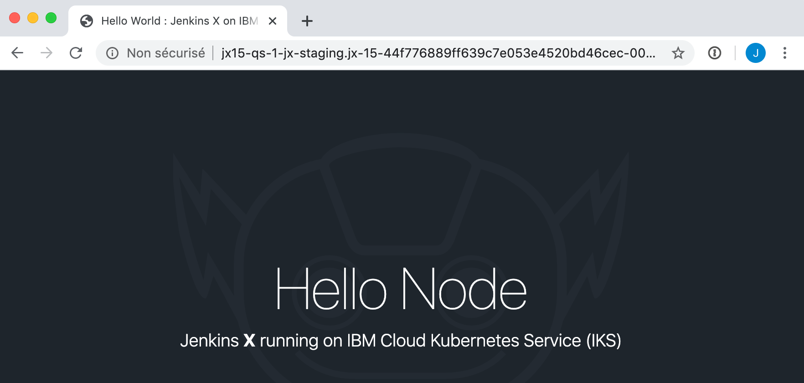

# Installing Jenkins-X on IBM Cloud

This tutorial describes how to install Jenkins-X on an existing IKS cluster and deploy applications using the IBM Cloud registry.

## Pre-Requisites

This tutorial was tested with the following package versions:

| Package Name  | Version     |
| ------------- |:------------|
| [jx CLI](https://jenkins-x.io/docs/getting-started/setup/install/)                          | v2.0.1258 |
| [IKS cluster](https://cloud.ibm.com/kubernetes/clusters)                 | v1.15.11+IKS |
| [kubectl CLI](https://kubernetes.io/fr/docs/tasks/tools/install-kubectl)                     | v1.14.3 & v1.16.3 |
| git                         | v2.20.1 (Apple Git-117) |
| OS                          | Mac OS X 10.14.6 build 18G3020 |
| [IBM Cloud CLI](https://cloud.ibm.com/docs/cli/reference/ibmcloud/download_cli.html#install_use)                         | v1.0.0 |
| IBM Cloud plugins container-registry  | v0.1.454 |
| IBM Cloud plugins kubernetes-service  | v1.0.15 |
| [Helm CLI](https://github.com/helm/helm) Client only                  | v2.12.3 |

> List of supported package versions for jx:
https://github.com/jenkins-x/jenkins-x-versions/tree/master/packages


## Retreive the information needed

1. Connect to your IKS cluster
    ```sh
    ibmcloud ks cluster config --cluster <iks-cluster-name>
    ```

1. Verify that you're connected to your cluster
    ```sh
    kubectl config current-context
    ```
    Output shows cluster-name/cluster-id as follows:
    ```
    my-iks-cluster/bptxxxxxxxnu0julbdg
    ```
    
1. Retrieve and copy the Ingress Subdomain of your cluster
    ```sh
    ibmcloud ks cluster get --cluster <iks-cluster-name> --json | jq ".ingressHostname" | tr -d '":,'
    ```
    Output:
    ```
    my-iks-cluster-44f776XXXXXXXXXXXXXXXXXbd46cec-0000.eu-de.containers.appdomain.cloud
    ```

1. Have on hand your `GitHub account` (displayed in the "Your profile" page) or your GitHub Organisation name (`username` below)

## Set up the Jenkins-X requirements

1. Clone the jenkins-x-boot-config on your local disk
    ```sh
    git clone https://github.com/jenkins-x/jenkins-x-boot-config.git
    ```

1. `cd` into the cloned directory
    ```sh
    cd jenkins-x-boot-config
    ```

1. Modify the `jx-requirements.yml` to:
   1. update your cluster name in the field `clusterName`
   1. update your GitHub account in the field `environmentGitOwner`
   1. update your Ingress Subdomain in the field `domain`
   1. replace the field `provider` with `iks`
   1. add a line to specify the IBM Container Registry: `registry: de.icr.io`
   1. add a line to specify the IBM Cloud region: `region: eu-de`

1. Ater the modifications, the `jx-requirements.yml` should look like this:
    ```yaml
    cluster:
      clusterName: my-iks-cluster
      environmentGitOwner: my-github-account
      environmentGitPublic: false
      project: ""
      provider: iks
      zone: ""
      registry: de.icr.io
      region: eu-de
    gitops: true
    environments:
    - key: dev
    - key: staging
    - key: production
    ingress:
      domain: my-iks-cluster-44f776XXXXXXXXXXXXXXXXXbd46cec-0000.eu-de.containers.appdomain.cloud
      externalDNS: false
      namespaceSubDomain: -jx.
      tls:
        email: ""
        enabled: false
        production: false
    kaniko: true
    repository: nexus
    secretStorage: local
    storage:
      backup:
        enabled: false
        url: ""
      logs:
        enabled: false
        url: ""
      reports:
        enabled: false
        url: ""
      repository:
        enabled: false
        url: ""
    vault: {}
    velero:
      schedule: ""
      ttl: ""
    versionStream:
      ref: v1.0.406
      url: https://github.com/jenkins-x/jenkins-x-versions.git
    webhook: prow
    ```

## Installing Jenkins-X with `jx boot`

1. Run the `jx boot` command
    ```sh
    jx boot
    ```

1. Jenkins-X works on IKS so just validate when being asked 
    ```
    When being asked jx boot has only been validated on GKE and EKS, we'd love feedback and contributions for other Kubernetes providers```

1. Answer some remaining questions, e.g. Git/GitHub user.
    ```
    ? Jenkins X Admin Username *****
    ? Jenkins X Admin Password [? for help] *****
    ? Pipeline bot Git username *****
    ? Pipeline bot Git email address *****
    ? Pipeline bot Git token [? for help] ****************************************
    Generated token XXXXXXXXXXXXXXX, to use it press enter.
    This is the only time you will be shown it so remember to save it
    ? HMAC token, used to validate incoming webhooks. Press enter to use the generated token [? for help]
    Do you want to configure an external Docker Registry? No
    ```
    
    > Make sure to answer **No** to the question **Do you want to configure an external Docker Registry?**

1. Once the installation is complete, you should see a message similar to this:

    ```
    Installation is currently looking: GOOD
    Using namespace 'jx' from context named 'jxcluster/boumltjf0rljb7kbmbu0' on server 'https://c2.eu-de.containers.cloud.ibm.com:25118'.
    ```

## Set up the IBM Cloud Container Registry authorization (after Jenkins-X has installed)

1. Go into the `jx` namespace created during the installation
    ```
    jx ns jx
    ```

1. Create a namespace in the IBM Cloud Container Registry Service that matches your GitHub organization name or your GitHub username. If the names do not match, then the Jenkins-X quickstart project cannot use the Container Registry. For your own project, you will of course define the registry namespace that you want
    ```
    ibmcloud cr namespace-add <your-github-org>
    ```
    
1. Create an API key which will be used to authorize Jenkins-X to push to the IBM Container Registry. (For production environments, create a Service ID API Key with Container Registry write permissions)
    ```
    ibmcloud iam api-key-create <key-name> -d "Jenkins X API Key" --file <filename>
    ```

1. Use `jx create docker auth command` to update the registry authorization with your own API key
    ```
    jx create docker auth --host "de.icr.io" --user "iamapikey" --secret "<YOURAPIKEY>" --email "a@b.c"
    ```

1. Create the following 3 kubernetes namespaces
    ```
    kubectl create namespace jx-dev
    kubectl create namespace jx-staging
    kubectl create namespace jx-production
    ```

1. Copy and rename the default secret to any environment namespaces that you are using with jx (here: dev, staging, production). These steps update the secret for the jx-dev, jx-staging and jx-production namespaces.
    ```sh
    kubectl get secret default-de-icr-io -o yaml -n default | sed 's/default/jx-dev/g' | kubectl -n jx-dev create -f -
    kubectl get secret default-de-icr-io -o yaml -n default | sed 's/default/jx-staging/g' | kubectl -n jx-staging create -f -
    kubectl get secret default-de-icr-io -o yaml -n default | sed 's/default/jx-production/g' | kubectl -n jx-production create -f -
    ```

1. Patch the ServiceAccounts to use the pull secrets in the new namespaces

    ```
    kubectl patch serviceaccount default -p '{"imagePullSecrets": [{"name": "jx-dev-de-icr-io"}]}' -n jx-dev
    kubectl patch serviceaccount default -p '{"imagePullSecrets": [{"name": "jx-staging-de-icr-io"}]}' -n jx-staging
    kubectl patch serviceaccount default -p '{"imagePullSecrets": [{"name": "jx-production-de-icr-io"}]}' -n jx-production
    ```

## Test the project

1. Start a first project
    ```
    jx create quickstart
    ```
    Select **node-http**

1. Check the activity
    ```
    jx get activity -f <jx-project-name> -w
    ```

1. Enter the project your created.
    ```
    jx get applications
    ```
    Output:
    ````
    APPLICATION STAGING PODS URL
    jx15-qs-1   0.0.5   1/1  http://jx15-qs-1-jx-staging.jx-15-44f776889ff639c7e053e4520bd46cec-0000.eu-de.containers.appdomain.cloud
    ```

1. Open the app running in IKS 

    

1. Display the images used in the IBM Cloud registry
    ```
    ibmcloud cr images --restrict <your-github-org>
    ```
    Output:
    ````
    Liste des images...

    Référentiel                        Etiquette   Condensé       Espace de nom   Créé             Taille   Statut de sécurité
    de.icr.io/<your-github-org>/jx15-qs-1         0.0.1       2d2f5214025b   <your-github-org>         29 minutes ago   67 MB    41 problèmes
    ```

## How to use IBM Cloud registry with the preview environments

If you want to use the Jenkins-X Preview Environments feature, you need to replicate automatically the registry secret in the temporary namespaces created to test the PullRequests. To do that you can use the [kubernetes-replicator](https://github.com/mittwald/kubernetes-replicator).

1. Install kubernetes-replicator in your cluster
```shell
# Create roles and service accounts
kubectl apply -f https://raw.githubusercontent.com/mittwald/kubernetes-replicator/master/deploy/rbac.yaml
# Create actual deployment
kubectl apply -f https://raw.githubusercontent.com/mittwald/kubernetes-replicator/master/deploy/deployment.yaml
```
2. Update the registry secret in the default namespace
Add the following lines in the `default-de-icr-io` secret in order to allow its replication in the namespaces prefixed by `jx-`
```yaml
metadata:
  annotations:
    replicator.v1.mittwald.de/replication-allowed: "true"
    replicator.v1.mittwald.de/replication-allowed-namespaces: "jx-*"
```
3. Create a `secret.yaml` file in the templates directory of your application to replicate the `default/default-de-icr-io` secret when Jenkins-x create a new namespace.
```yaml
apiVersion: v1
kind: Secret
metadata:
  name: regcred
  annotations:
    replicator.v1.mittwald.de/replicate-from: default/default-de-icr-io
type: kubernetes.io/dockerconfigjson
data:
  .dockerconfigjson: e30K
```
4. Add the use of this secret for your application by adding the following lines in your deployments.yaml template file
```yaml
      imagePullSecrets:
      - name: regcred
```
