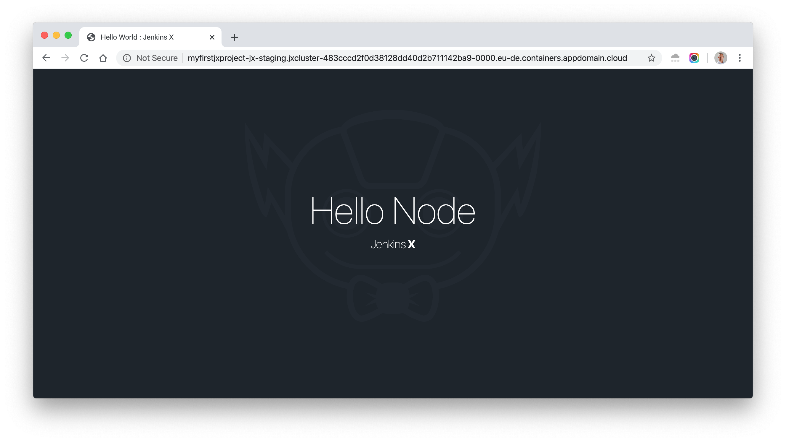

## Pre-Requisites

* A IKS cluster v1.15.X. A cluster can be provisioned [here](https://cloud.ibm.com/kubernetes/clusters)
* Jenkins-X v

## Jenkins-X Boot

1. Make sure you're connected to the cluster.
    ```sh
    ic ks cluster config --cluster <cluster-name>
    ```

1. Run the export KUBECONFIG command

1. Copy the file `jx-requirements-iks.yml` to store the IKS requirements
    ```sh
    cp jx-requirements-iks-template.yml jx-requirements-iks.yml
    ```

1. Run the command 
    ```sh
    ibmcloud ks cluster get <cluster-name>
    ```
    Copy the value of the field **Ingress Subdomain**

1. Edit the file and replace the values <> such as the cluster name, the github user name, the ingress subdomain.

    ```yml
    cluster:
      clusterName: <iks-cluster-name>
      devEnvApprovers:
      - <username>
      provider: kubernetes
      environmentGitOwner: <username>
      environmentGitPublic: true
      registry: de.icr.io
    environments:
    - ingress:
        domain: <iks-cluster-ingress-subdomain>
      key: dev
    - ingress:
        domain: <iks-cluster-ingress-subdomain>
      key: staging
    - ingress:
        domain: <iks-cluster-ingress-subdomain>
      key: production
    ingress:
      domain: <iks-cluster-ingress-subdomain>
    ```

1. Run the `jx boot` command with the requirements file which will overwrite the default requirements file
    ```sh
    jx boot --requirements=./jx-requirements-iks.yml
    ```

1. Yes Jenkins-X works on IKS so just validate when being asked 
    ```When being asked jx boot has only been validated on GKE and EKS, we'd love feedback and contributions for other Kubernetes providers```

    ```
    ? Jenkins X Admin Username admin
    ? Jenkins X Admin Password [? for help] *****
    ? Pipeline bot Git username lionelmace
    ? Pipeline bot Git email address email@gmail.com
    ? Pipeline bot Git token [? for help] ****************************************
    Generated token XXXXXXXXXXXXXXX, to use it press enter.
    This is the only time you will be shown it so remember to save it
    ? HMAC token, used to validate incoming webhooks. Press enter to use the generated token [? for help]
    Do you want to configure an external Docker Registry?By default Jenkins X will use the docker registry from the cloud provider. If you want to configure an external docker regi? Docker Registry Url https://index.docker.io/v1/
    ? Docker Registry username lionelmace
    ? Docker Registry password [? for help] ********
    ? Docker Registry email email@gmail.com
    ```

1. Once the installation is complete, you should see a message similar to this:

    ```
    Installation is currently looking: GOOD
    Using namespace 'jx' from context named 'jxcluster/boumltjf0rljb7kbmbu0' on server 'https://c2.eu-de.containers.cloud.ibm.com:25118'.
    ```

## Activate the IBM Cloud Container Registry

1. Create a namespace in the IBM Cloud Container Registry Service that matches your GitHub organization name. If the names do not match, then Jenkins-X cannot use the Container Registry.
    
    ```
    ibmcloud cr namespace-add <your-github-org>
    ```

1. While Jenkins-X is installing, create an API key to authorize Jenkins-X to push to the Container Registry. For production environments, create a Service ID API Key with Container Registry write permissions.

    ```
    ibmcloud iam api-key-create <key-name> -d "Jenkins X API Key" --file <filename>
    ```

1. After Jenkins-X has installed, use jx create docker auth command to update the registry authorization.

    ```
    jx create docker auth --host "de.icr.io" --user "iamapikey" --secret "<IAMAPIKEY>" --email "a@b.c"
    ```

1. Copy and rename the default secret to any environment namespaces that you are using. These steps update the secret for the jx-staging and jx-production namespaces.

    OK
    ```sh
    kubectl get secret default-de-icr-io -o yaml -n default | sed 's/default/jx-staging/g' | kubectl -n jx-staging create -f -
    ```
    Output:
    secret/jx-staging-de-icr-io created

    NOK
    ```sh
    kubectl get secret default-de-icr-io -o yaml -n default | sed 's/default/jx-production/g' | kubectl -n jx-production create -f -
    ```
    Output:
    Error from server (NotFound): error when creating "STDIN": namespaces "jx-production" not found

1. Patch the ServiceAccounts to use the pull secret in the new namespaces

    ```
    kubectl patch serviceaccount default -p '{"imagePullSecrets": [{"name": "jx-staging-de-icr-io"}]}' -n jx-staging
    ```
    Output:
    serviceaccount/default patched

## Test the project

1. Start a first project
    ```
    jx create quickstart
    ```
    Select node-http

1. Enter the project your created.
    ```
    jx get applications
    ```
    Output:

    APPLICATION      STAGING PODS URL
    myfirstjxproject 0.0.1   1/1  http://myfirstjxproject-jx-staging.jxcluster-483cccd2f0d38128dd40d2b711142ba9-0000.eu-de.containers.appdomain.cloud

1. Open the app running in IKS 

    